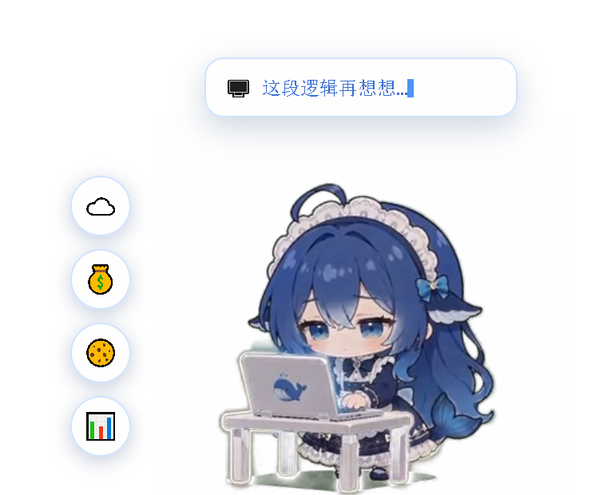
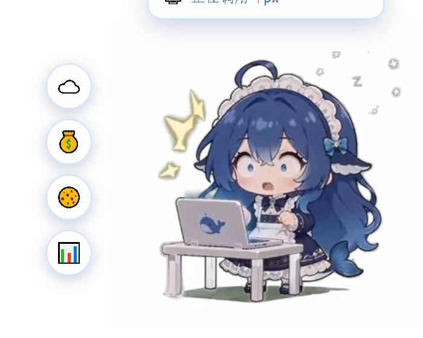
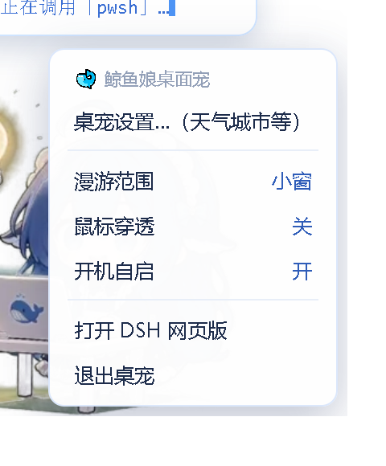
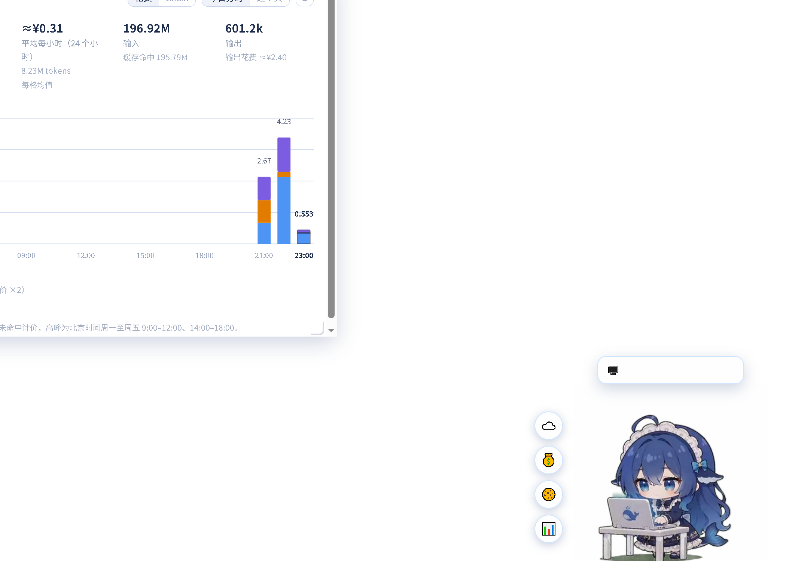
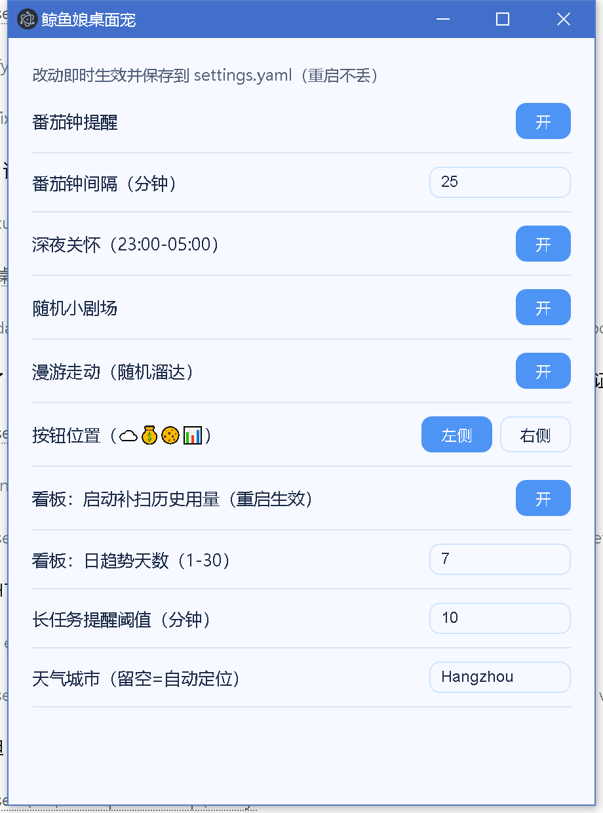

# 🐋 鲸鱼娘桌面宠 · Whale Girl Desktop Pet

把 [dsh-whale-girl-pet](https://github.com/yanzwzz/dsh-whale-girl-pet) 的鲸鱼娘**原样**搬到 Windows 桌面上。

透明置顶浮窗、50 个透明动画、打字机气泡、分时段花费看板、实时余额、屏幕漫游、
鼠标穿透、右键菜单、开机自启 —— 全部和网页版逐字一致，因为**跑的就是原版代码**。



---

## ✨ 功能

| | |
|---|---|
| 🎬 **50 个透明动画** | 待机、东张西望、敲键盘、摸鱼、收工庆祝、睡觉三连、吃小鱼干… |
| ⌨️ **打字机气泡** | 干活时头顶逐字打出「正在调用「pwsh」…」「def 努力干活():」，蓝色等宽 + 闪烁光标 |
| 🐟 **状态联动** | 开工坐桌前 → 每 10.5 秒换一段工作动画循环 → 收工庆祝 + 完成通知（用时/消耗/花费） |
| 💰 **实时余额** | 点 💰 查 DeepSeek 余额 + 今日用量（三桶拆分） |
| 🍪 **充值到账会吃零食** | 右键「💰 充值 DeepSeek…」→ 到账后自动投喂：**打断当前动画吃小鱼干**，吃完若还在干活就接回工作轮播，否则回待机链 |
| 📊 **分时段花费看板** | 手写 SVG 三桶堆叠柱：今日分时 + 近 7 日趋势 + 缓存命中率 |
| ☁️ **天气** | 明日预报，支持自定义城市（不依赖会出错的 IP 定位） |
| 🚶 **屏幕漫游** | 她会自己在桌面上溜达 |
| 🖱️ **鼠标穿透** | 整窗默认穿透，只在光标落进她身上/按钮/气泡时恢复可点；`Ctrl+Alt+W` 随时切换 |
| 🖲️ **右键菜单** | 在她身上右键：设置 / 充值 / **尺寸滑块** / 漫游范围 / 鼠标穿透 / 开机自启 / 退出 |
| 🌙 **睡眠 · 番茄钟 · 深夜关怀** | 空闲 5 分钟入睡；连续工作提醒休息；深夜催你睡觉 |
| 🔔 **常驻保障** | 开机自启 + 守护进程 + DSH 启动插件，三层保证她一直在 |

### 截图

| 工作时（打字机气泡） | 右键菜单 |
|---|---|
|  |  |

| 分时段花费看板 | 设置面板 |
|---|---|
|  |  |

---

## 🎯 为什么是「原样」

大多数「把网页插件搬到桌面」的方案会重写一遍行为逻辑，结果总是差一点：
动画节奏不对、气泡文案不同、少个按钮。这里的做法是**几乎不改原版代码**
（全部改动只有 1 处，见 `NOTICE.md`，为了新增的充值投喂功能）：

```
┌─ Electron 主进程 (main.js) ─────────────────────────────────┐
│  · 迷你 DSH 宿主服务器 (pet-server.js)   ← 同源 HTTP         │
│  · 宿主端接口实现 (pet-api.js)           ← 状态/用量/余额/天气 │
│  · 会话用量计算 (usage-source.js)        ← 读 ~/.dsh/sessions │
│  · 透明置顶窗口 + 按矩形精确鼠标穿透                          │
│  · 托盘 / 全局快捷键 / 开机自启 / 守护                        │
└─────────────────────────────────────────────────────────────┘
                            │  http://127.0.0.1:<随机端口>/
                            ▼
┌─ 渲染进程 (renderer/shell.html) ────────────────────────────┐
│  · React 18 + window.__ModuleLoader__ + ctx.slots/locale 桩  │
│  · vendor/dsh-whale-girl-pet.client.js   ← 原版（仅 1 处改动）│
└─────────────────────────────────────────────────────────────┘
```

原版 `client.js`（2732 行）是标准的 DSH 客户端 bundle：
它用 `window.__ModuleLoader__.load({ id, factory })` 注册自己，`factory(require)`
拿 React，最后导出 `{ name, inject, apply }`，在 `apply(ctx)` 里通过
`ctx.slots.inject('shell.overlay', …)` 把宠物挂到界面上。

于是只要补齐三样东西，它就能在桌面窗口里**原样运行**：

1. **`__ModuleLoader__` + `require` 垫片** —— 提供 React / jsx-runtime / react-dom
2. **`ctx` 桩** —— 实现它真正用到的 `slots` / `locale` / `effect`
3. **同源 HTTP 接口** —— 视频路由 + 6 个数据接口，严格按原版契约

所以动画轮播节奏、打字机文案、看板 SVG 画法、按钮位置、拖拽与漫游，
**都不是"照着做"的，而是原代码本身在跑**。

### 接口契约里几个容易踩的点

从原版宿主端源码逐字段抠出来、实现时必须对齐的几条：

- `/api/whale-pet/state` 是**破坏性读取**（取走即清）。不这么做，桌宠每 800ms
  轮询一次就会把同一条通知反复播一遍。
- `items` 只有三种：`mood(working|idle)` / `activity(name)` / `done(ok,title,message)`。
  其中 `title === '任务完成啦！'` 会触发「工作结束」动画。
- `/api/whale-pet/usage` 里 **`hours[]` 用 `day`，`days[]` 用 `date`**。
  client 靠 `days` 末行的 `date` 去匹配 `hours[].day`，这一条对不上图表就是空的。
- 设置是**增量 patch**（`{ops:[{op:'set',path:[...],value}]}`），不是整体覆盖。
  做成覆盖式的话，点一个开关会把没提交的字段全重置。
- `/pet/thumb/<名>.webm` 必须支持 **HEAD**（client 用它探测动画是否存在），
  未知名字必须 404 —— 被 SPA 兜底成 200 HTML 的话，探测会误判动画存在。

### 数据从哪来

DSH 的网页接口对普通进程返回 403（需要浏览器令牌），所以用量**直接读本机的
会话事件流**自己算：

- 事件文件是**追加写的多帧 zstd**，Node 的 `zstdDecompressSync` 只解第一帧，
  所以按帧魔数 `28 B5 2F FD` 切开逐帧解压；
- 计费口径**不自己发明** —— 直接复用原版的 `lib/usage.js`（已 vendor 到
  `vendor/usage.mjs`），保证和网页版同价目、同三桶、同峰谷规则。

### 工作状态怎么判断

一开始我用「会话文件多少秒没变化」来猜收工，结果是**活还没干完就报"任务完成"**：
模型思考、长工具调用期间文件本来就不写。

正确信号是 DSH 自己写进事件流的**真实回合边界** `turn/start` / `turn/end`。
现在按 `seq` 增量消费文件尾部事件，只在 `turn/end` 时才收工。
（实测 90 秒静默期仍保持工作动画。）

### 关于「遮挡」这件事（踩过的坑）

第一版把窗口铺满整个工作区，结果**一点桌宠，DSH 界面就冻住**。

排查过程：截图比对同一区域，发现点击后 DSH **连续三张截图完全相同** —— 它停止绘制了。
原因是 Chromium 的原生窗口遮挡检测：窗口被**完全遮挡**时会停止绘制它。

所以最后的设计是：**桌宠窗口尽量铺满，但永远不完全覆盖 DSH 窗口**。
从 DSH 自己写的 `main-window-state.json` 读它的位置，把桌宠窗口的左边缘或上边缘
推到 DSH 左/上边缘之后 16px，两者取面积大的方向。

```
屏幕        3840 × 2160
DSH         (450,218)-(3034,1910)
桌宠        3840 × 1910   ← 铺满整宽，只让开顶部 125px，因此不可能完全遮挡 DSH
```

同时窗口设成 `focusable: false`（`WS_EX_NOACTIVATE`），点它**不抢 DSH 的焦点**。

如果你希望连那一条也让出来（真正的全屏），可以给 DSH 加启动参数：

```powershell
# 给桌面/开始菜单的 DSH 快捷方式加上（改完从快捷方式启动才生效）
--disable-features=CalculateNativeWinOcclusion
```

桌宠会**自动检测**运行中的 DSH 有没有带这个参数：带了就全屏，没带就用上面那块
「避让区」，并且每分钟复查一次 —— 你重启 DSH 之后它会自己切过去。

---

## 📦 安装

需要 **Windows 10/11**（依赖 PowerShell 守护脚本与 Windows 启动文件夹）。

```powershell
git clone https://github.com/lyl1352/whale-girl-desktop-pet.git
cd whale-girl-desktop-pet

# 1) 下载动画资源（50 个透明 WebM，从 npm 拉 dsh-whale-girl-pet）
powershell -NoProfile -ExecutionPolicy Bypass -File tools/fetch-assets.ps1

# 2) 下载 Electron 运行时（约 140MB，默认走 npmmirror 国内镜像）
powershell -NoProfile -ExecutionPolicy Bypass -File tools/fetch-electron.ps1

# 3) 启动
.\electron\electron.exe .
```

> 动画素材不随仓库分发（26MB 二进制，且属于原项目），安装时从 npm 拉取，
> 这样仓库只有 1MB 左右。

**余额/花费功能**需要本机存在 DeepSeek API Key：

```
%USERPROFILE%\.dsh\.credentials.yaml
```

里面要有 `DEEPSEEK_API_KEY: sk-...`（DSH 用户默认就有）。
**没有也能跑**，只是余额与花费显示不出来。

---

## 🎮 使用

| 操作 | 效果 |
|---|---|
| 左键单击 | 随机「点击回应」动画；她忙的时候会说「正在忙，别摸我啦！」 |
| 双击 | 摸头 |
| 拖动 | 拖着她走（会播被拖拽的动画） |
| **右键** | 弹出菜单：桌宠设置 / 💰 充值 / **尺寸滑块（120–400px，实时生效）** / 漫游范围 / 鼠标穿透 / 开机自启 / 退出 |
| 侧边按钮 | ☁️ 天气 · 💰 余额 · 🍪 投喂 · 📊 分时段花费看板 |
| 托盘图标右键 | 同一套菜单 + 开机自启开关 |
| `Ctrl+Alt+W` | 随时切换鼠标穿透（穿透时唯一的键盘出口） |

> **穿透模式下怎么点回来？** 把鼠标移到她身上或余额木牌上，窗口会自动恢复可点
> （每 60ms 按光标位置判断）。另外托盘图标和 `Ctrl+Alt+W` 也都能关掉穿透。

> **右键菜单为什么是自己画的？** 因为窗口设了 `focusable:false`，Electron 的原生
> `Menu.popup()` 在这种窗口上不显示；改成可聚焦又会把焦点从 DSH 抢走。所以菜单是
> 在窗口内自绘的 HTML。

### 💰 充值到账 → 她吃零食

右键 →「💰 充值 DeepSeek…」会打开充值页，同时开始盯余额（每 10 秒查一次，最多 15 分钟）。

**判据是「实充金额」而不是总额**，这点很关键：

| 字段 | 能否当判据 | 原因 |
|---|---|---|
| `total_balance`（总额） | ❌ | 赠送额度刷新也会让它变大，会把「发额度」误判成「充值」 |
| **`topped_up_balance`（实充）** | ✅ | **只在真的充钱时增加**，用量消耗与赠送刷新都不影响它 |

检测到增加后还会**隔 2.5 秒复读一次确认**，两次都增加才判定到账（防接口抖动误报）。

到账后：

```
工作中：认真工作 ──打断──> 吃小鱼干（完整 10s）──> 认真工作
待机中：待机呼吸 ──打断──> 吃小鱼干（完整 10s）──> 待机呼吸
```

「吃完接回原状态」不需要外壳做任何协调：`吃小鱼干` 本来就在原版的 `INTERRUPT`
集合里，`handleEnded` 会自动判断"还在工作就 `playWorking()`，否则回待机链"。

> 投喂本身有 **30 秒冷却**（原版设定）。间隔太近再充值，她会说「刚吃过啦，等会儿再喂～」。

---

## ⚙️ 配置

右键她 →「**桌宠设置…**」，打开的就是原版设置面板：

番茄钟提醒 / 番茄钟间隔 / 深夜关怀 / 随机小剧场 / **漫游走动** / 按钮位置 /
看板补扫历史 / 看板日趋势天数 / 长任务提醒阈值 / **天气城市**

配置存在 `%USERPROFILE%\.whale-pet-desktop\config.json`。

---

## 🔔 怎么保证她一直在

三层，互相兜底：

| 机制 | 触发时机 | 说明 |
|---|---|---|
| **开机自启** | 登录 Windows | 启动文件夹里一个 `.lnk`，**直接指向 `electron.exe`** |
| **DSH 启动插件** `dsh-plugin/` | 启动 DSH | DSH 一起来就把桌宠拉起，之后每分钟确认 |
| **守护脚本** `watchdog.ps1` | 手动（可选） | 每 20 秒检查，桌宠不在就拉起来 |

安装 DSH 插件（可选，但推荐）：

```powershell
dsh plugin --profile desktop add <本仓库路径>\dsh-plugin
```

> 为什么需要插件？因为 DSH 重启会把它派生的进程一起杀掉，桌宠也会被带走。
> 由 DSH 自己启动桌宠，就能保证「打开 DSH，她就在」。

> ⚠️ **杀软误报（踩过的坑）**：开机自启最早写的是「启动文件夹放一个 `.cmd` →
> 用 `powershell.exe -ExecutionPolicy Bypass -WindowStyle Hidden` 拉起 `watchdog.ps1`」。
> 这套组合是杀软启发式里最经典的恶意特征（**启动项 + 隐藏 PowerShell**），
> 实测被 **火绒** 直接删掉了开机项，而且守护进程每次启动都被按掉。
>
> 现在开机自启用 `shell.writeShortcutLink` 生成 `.lnk` **直接指向 `electron.exe`**，
> 启动链上完全没有 PowerShell；崩溃自愈交给 DSH 插件。`watchdog.ps1` 保留在仓库里，
> 需要时手动跑。

> **如果杀软仍然误报**，把整个仓库目录加进信任区即可
> （火绒：`防护中心 → 信任区 → 添加目录`）：
> ```
> C:\Users\PC\whale-pet-desktop
> ```

> **守护脚本的一个坑**：上一个守护被强杀时，全局互斥量会进入 `abandoned` 状态，
> 此时 .NET 的 `Mutex.WaitOne` 会**抛 `AbandonedMutexException`** 而不是返回 `false`。
> 不接这个异常的话，新守护会一启动就异常退出 —— 表现就是「桌宠被杀过一次之后再也
> 起不来」。脚本里已经用 `try/catch` 处理并接管。

> **托盘幽灵图标**：进程被强杀（`Stop-Process -Force`）时，通知区的图标不会自己消失，
> 要等鼠标划过才清。正常退出时本程序会主动 `tray.destroy()` 注销图标。

---

## 🔒 数据与隐私

- 余额接口用本机 Key 直连 `api.deepseek.com`，**不经过任何第三方**
- 会话用量只在本机读取计算，**没有任何上报**
- 迷你宿主服务器只监听 `127.0.0.1`
- 仓库里**不含任何密钥**（API Key 运行时从 `~/.dsh/.credentials.yaml` 读）

## ⚠️ 已知限制

- **只支持 Windows**（依赖 Windows 启动文件夹与 `.lnk`）
- 首次运行需要下载 Electron（约 140MB）
- 设置面板是从右键/托盘打开的**独立窗口**（网页版它是 DSH 设置页里的一节）
- 动画素材是 **360×360**（上游仓库与 Release 里只有这一档，没有更高清版本）。
  在 200% 缩放的屏幕上，显示尺寸 260 CSS px 会占 520 物理像素，等于把素材放大
  1.44 倍，**边缘会有点糊**。把尺寸调到 **180**（=360 物理像素，1:1 像素对齐）最锐利，
  200 也算清晰 —— 右下角**右键菜单里有尺寸滑块**，拖动即时生效并自动记下来。
- 若不给 DSH 加 `--disable-features=CalculateNativeWinOcclusion`，桌宠活动范围会
  让开 DSH 窗口一条边（见上方「关于遮挡」）

## 📄 许可证与致谢

本项目（**外壳部分**）以 **MIT** 发布。

桌宠本体的立绘、动画、浏览器端代码与计费内核来自
**[yanzwzz/dsh-whale-girl-pet](https://github.com/yanzwzz/dsh-whale-girl-pet)**
（MIT，Copyright (c) 2026 dsh-whale-girl-pet contributors）。本仓库对它的改动只有
`NOTICE.md` 里列出的 1 处（为充值投喂功能），其余全部原样使用。

React / ReactDOM（MIT，Meta Platforms）与 Electron（MIT）同样见 `NOTICE.md` 与
`vendor/LICENSE-*`。**分发时请保留这些声明。**
